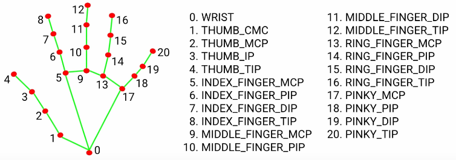

# Требования

1. Считывание кадров с веб-камеры
2. Нахождение указательных пальцев, если они есть в кадре
3. Рисовать на кадре траекторию пальцев
4. Выводить обработанные кадры


Баллы:

* 3 балла - обучена своя модель детекции ключевых точек кисти (backbone + head)
* 4 балла - произведено сравнение с open-source моделями
* 5 баллов - написано приложение

# Hand Landmarks



# Запуск

```bash
git clone https://github.com/vederko-p/itmo_finger_tracker.git

cd itmo_finger_tracker

conda env create -f conda_env.yml

conda activate gphmr

git clone https://github.com/hassony2/manopth.git

cd manopth

python3 -m pip install -e .

cd ..
```

```bash
python3 -m src.main
```

# Models Summary

|Model|OKS|
|:----|:--|
|Mediapipe Hand Key Points Detector|0.341|
|Self Made Detector|0.263|
